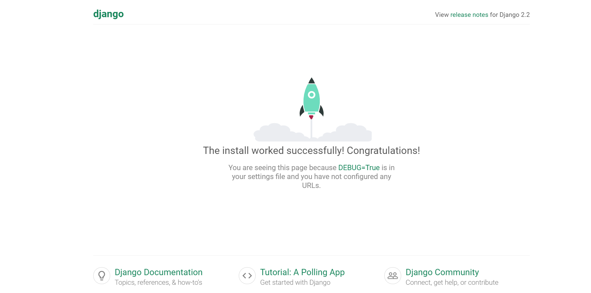
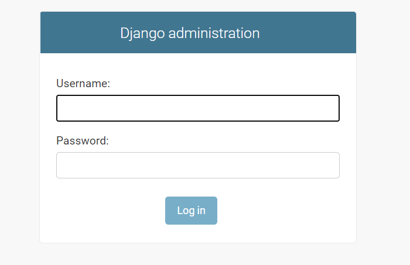
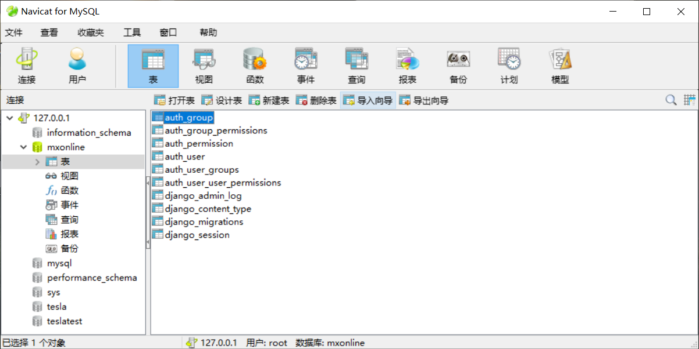
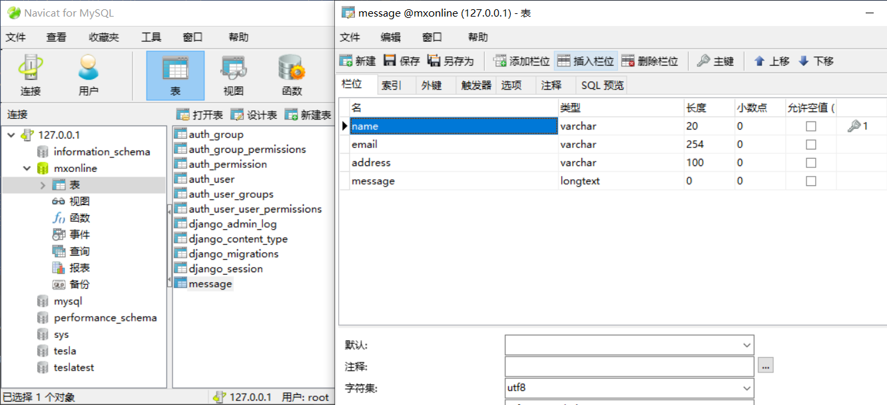
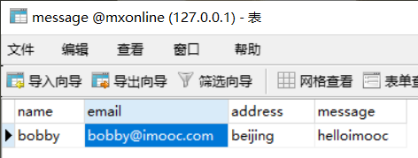
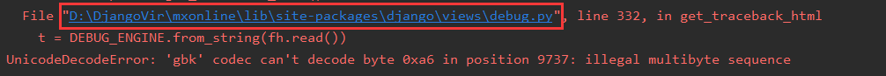
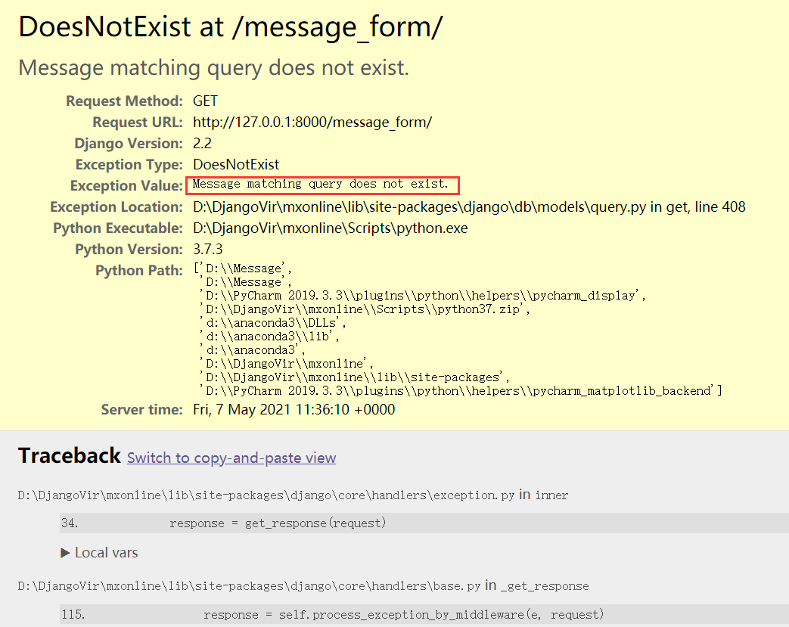
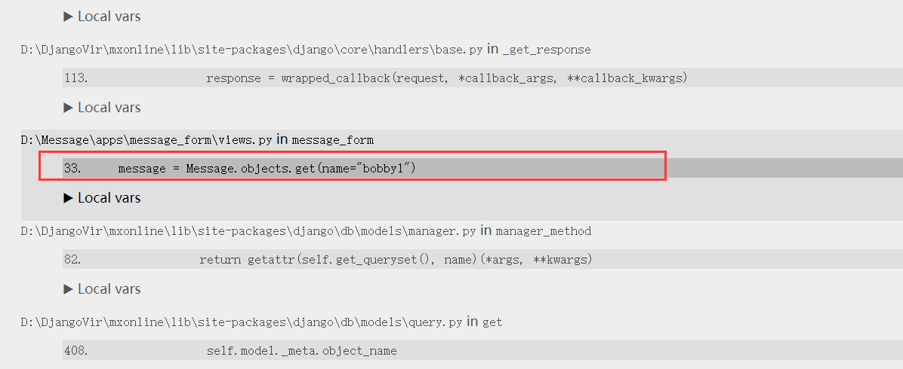
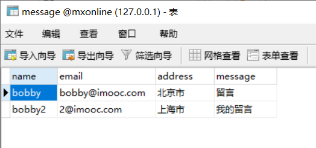
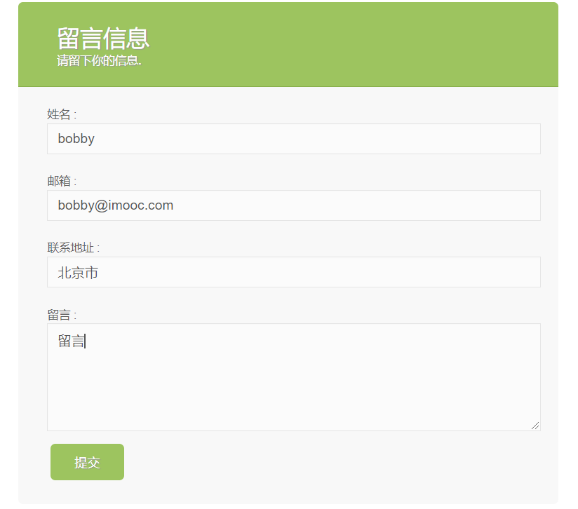

@[TOC](Django留言板项目完整搭建)
# 1.新建python虚拟环境

新建一个文件夹

系统变量里添加这个WORKON_HOME变量，然后将刚才的文件夹路径填进去再重启（可将虚拟环境新建在指定路径，不然会建在C盘）

这里使用的WORKON_HOME变量值为D:\DjangoVir

建立新的文件夹中右键进入cmd

`pip install virtualenvwrapper-win`（有的话不用安装）

`mkvirtualenv -p D:\Anaconda3\python.exe mxonline`

# 2.安装Django并新建Django项目

`pip install django==2.2 -i https://pypi.douban.com/simple`

在pycharm中新建Django项目-选择已存在的解释器-选择刚才新建的python虚拟环境下的python.exe

在More Settings-Application name中填入“应用名”

这里使用的应用名为message_form

# 3.生成的目录说明

1.其中自动创建的"应用名“文件夹下的migrations文件夹，在数据库迁移时用到

2.其中的templates文件夹用来存放html文件

3.manage.py为启动Django项目的入口文件

# 4.新建一些目录

1.在项目中New一个Directory-命名为static，用来存放js、css、图片等文件

2.在项目中New一个Directory-命名为media，用来存放用户上传的文件、图片等

3.Django项目变大的时候应用会增多，此时在项目中New一个Python Package命名为apps

将建立的应用文件夹"应用名_form"拖动到apps中，采用拖动的方式可以对应修改配置（要勾选Search for references）

4.之后会引入一些第三方应用，此时在项目中New一个Python Package命名为extra_apps，用来存放第三方源码

5.再在项目中New一个File命名为requirements.txt，用来记录项目依赖于哪些第三方包，写入：

`django==2.2`

**备注：**

## 1.进入虚拟环境的命令

`workon mxonline`

## 2.可以用Django的命令来新建应用，有两种方式：

注：在创建Django项目时，未在More Settings-Application name中填入“应用名”时需要通过这种方法来手动创建

### 1.cmd

cd到项目所在目录下

输入：`python manage.py startapp 应用名`

### 2.Pycharm

菜单栏-Tools-run setup.py Task

输入：`startapp 应用名`

注：

使用Django命令来新建应用时，settings.py中：

INSTALLED_APPS中并没有被配置，要进行手动配置

```python
INSTALLED_APPS = [
    'django.contrib.admin',
    'django.contrib.auth',
    'django.contrib.contenttypes',
    'django.contrib.sessions',
    'django.contrib.messages',
    'django.contrib.staticfiles',
    # 手动添加
    'apps.应用名.apps.应用名Config'
]
```
**mysql数据库密码：root**

# 3.配置访问html页面的url

将”留言板.html“粘贴到templates文件夹下，右键-Rename为message_form.html

菜单栏-Run-Run-选择Django项目

控制台显示Django的默认端口为：http://127.0.0.1:8000/

粘贴到浏览器中进行访问，显示：



Django有自动配置的admin后台管理系统，输入http://127.0.0.1:8000/admin可查看




在Message中的urls.py中可以看到默认配置的admin：

```python
urlpatterns = [
    path('admin/', admin.site.urls),
]
```

在message_form的view.py中定义一个函数:

```python
from django.shortcuts import render
# 默认接受一个参数request，是Django传递进来的，每一个请求都会包装成一个request对象
def message_form(request):
    return render(request,"message_form.html")
```

在Message中的urls.py进行配置添加：

```python
from apps.message_form.views import message_form
urlpatterns = [
    path('admin/', admin.site.urls),
    path('message_form/', message_form),
]
```

运行Django项目，文件修改时会自动重启

浏览器中输入http://127.0.0.1:8000/message_form


# 4.配置html页面显示（将html和css分离）

在实际开发过程中，一般要将html文件和css样式分离

## 1.进行全局的分离设置（一般使用此方法）

在项目根目录下的static文件夹中新建一个css文件夹，再在此文件夹下新建一个Stylesheet文件（css），命名为style

`将message_form.html中的整个<style>标签剪贴到style.css中，再将<style>和</style>删除`

在message_form.html中添加link

```html
<link rel="stylesheet" href="/static/css/style.css">
```

在Message\settings.py中进行配置：

推荐使用相对路径：

```python
STATIC_URL = '/static/'
# 指明在哪里搜索静态文件
STATICFILES_DIRS = [
    # 若有多个搜索目录可以添加到这个list中
    # 使用相对路径
	os.path.join(BASE_DIR, 'static')
]
```

或者可以使用绝对路径（不推荐）

```python
STATIC_URL = '/static/'
# 指明在哪里搜索静态文件
STATICFILES_DIRS = [
    # 若有多个搜索目录可以添加到这个list中、
    # 右键-Copy path路径，将\改为/防止出现转义问题
	"D:/Message/static"
]
```

重新启动Django项目

刷新浏览器中的http://127.0.0.1:8000/message_form/

运行的样式和之前相同，即成功分离

## 2.也可以在单独的app中做分离

删掉message_form.html中的：

```html
<link rel="stylesheet" href="/static/css/style.css">
```

在message_form文件夹中新建一个static文件夹，再在此文件下新建一个css文件夹，再在此文件夹下新建一个Stylesheet文件（css），命名为style

`将message_form.html中的整个<style>标签剪贴到style.css中，再将<style>和</style>删除`

在message_form.html中添加link

```html
<link rel="stylesheet" href="/static/css/style.css">
```

重新启动Django项目

刷新浏览器中的http://127.0.0.1:8000/message_form/

运行的样式和之前相同，即成功分离

**总结：**

**配置一个html页面显示的步骤：**

1.配置url

2.配置对应的views逻辑

3.拆分静态（css,js,images）放入到static，html放到template下

	（1）可以放到全局的template和static目录之下
	
	（2）也可以放到对应的app下面

4.配置全局的static文件访问路径的配置STATICFILES_DIRS

# 5.设计数据库表

1.在Navicat中新建数据库mxonline，字符集选择utf8 -- UTF-8 Unicode，排序规则选择utf8_general_ci

2.菜单栏-Tools-Run manage.py Task

输入命令`makemigrations`

会看到"No changes detected"，因为没有设计model，所以没有变化

输入命令`migrate`，将记录同步到表当中

会看到在创建表，表会映射到数据库中，但默认为sqlite，所以还不能映射到mysql

在Message\settings.py中进行配置数据库：

在setting中可以看到使用的默认数据库是sqlite，要改为mysql

```python
DATABASES = {
    'default': {
        'ENGINE': 'django.db.backends.mysql',
        'NAME': "mxonline",
        'USER': "root",
        'PASSWORD': "root",
        # 若是线上的可以指向线上的地址
        'HOST': "127.0.0.1"
    }
}
```

安装mysql驱动：

在windows下mysql驱动安装容易出错，在https://www.lfd.uci.edu/~gohlke/pythonlibs/#mysqlclient手动下载安装包mysqlclient-1.4.6-cp37-cp37m-win_amd64.whl

在下载位置的文件框中输入`cmd`，再进入虚拟环境`workon mxonline`

进行安装`pip install mysqlclient-1.4.6-cp37-cp37m-win_amd64.whl`

重新运行Django项目，若没有报错，进行migrate

菜单栏-Tools-Run manage.py Task

输入命令`makemigrations`

输入命令`migrate`

会看到在创建表，表会映射到mysql数据库中

在Navicat中可看到Django新建了内置的表




生成了这些表便可以自己定义model

3.定义model

在apps/message_form/models.py中定义表：

```python
from django.db import models

# Create your models here.
class Message(models.Model):# 继承models.Model
    # 定义字段
    # max_length为必填字段，对应数据库中的varchar类型，verbose_name可理解为注释，并设置为主键
    name = models.CharField(max_length=20, verbose_name="姓名",primary_key=True)
    # EmailField是在CharField上的封装，会检测是否为邮箱，按住CTRL+左键点入可看到，已经默认设置了max_length,为254
    email = models.EmailField(verbose_name="邮箱")
    address = models.CharField(max_length=100, verbose_name="联系地址")
    # TextField不限字段长度
    message = models.TextField(verbose_name="留言信息")

    # 表中的meta信息
    class Meta:
        verbose_name = "留言信息"
        verbose_name_plural = verbose_name
        # 可以自己指定表名
        # 可以自己指定表名
        db_table = "message"

        # 若不指定表名，会生成名为message_form_message的表，表的命名为“app名称_类的名称(将大写转化为了小写)”
```

注：
在Message\settings.py中如果没有进行配置，models不会生成表

（此时已经配置，自己后加的app要进行配置）

```python
INSTALLED_APPS = [
	# 省略
    'apps.message_form.apps.MessageFormConfig',
]
```

4.此时进行makemigrate和migrate，便可以将表直接做映射

菜单栏-Tools-Run manage.py Task

输入命令`makemigrations`

显示Create model Message，此时在migrations文件夹中生成了py文件，记录了所做操作

输入命令`migrate`

显示Applying message_form.0001_initial，会应用刚才生成的文件

在Navicat中可看到，生成了名为message的表



# 6.通过Django提供的models来进行对数据库的增删改查

从models中获取数据：

在Navicat中双击表message，输入测试数据，CRTL+S保存




## 1.使用all()方法

### (1)QuerySet可以进行for操作

在message_form的view.py中:

```python
from django.shortcuts import render

from apps.message_form.models import Message
# 默认接受一个参数request，是Django传递进来的，每一个请求都会包装成一个request对象
def message_form(request):
    # all()取出所有数据,返回QuerySet对象，允许进行多种操作
    all_messages = Message.objects.all()
    # QuerySet类型可以进行for操作，遍历取出来的所有数据
    for message in all_messages:
        print(message.name)
    # 输出bobby
    return render(request,"message_form.html")
```

菜单栏-Run-Debug-运行Django项目，在网页中刷新页面

可看到控制台输出bobby

QuerySet对象经过for循环才可以变成message对象

### (2)QuerySet还可以进行切片操作，当做列表

```python
from django.shortcuts import render

from apps.message_form.models import Message
# 默认接受一个参数request，是Django传递进来的，每一个请求都会包装成一个request对象
def message_form(request):
    # all()取出所有数据,返回QuerySet对象，允许进行多种操作
    # 从索引0开始取，直到索引1为止，但不包括索引1
    all_messages = Message.objects.all()
    sliced_query = Message.objects.all()[:1]
    print(all_messages)
    # 输出：<QuerySet [<Message: Message object (bobby)>]>
    
    # 用.query方法来打印sql语句
    print(all_messages.query)
    # 输出：SELECT message.name, message.email, message.address, message.message FROM message
    print(sliced_query.query)
    # 输出：SELECT message.name, message.email, message.address, message.message FROM message  LIMIT 1
    return render(request,"message_form.html")
```

菜单栏-Run-Debug-运行Django项目，在网页中刷新页面

可看到控制台输出:

`<QuerySet [<Message: Message object (bobby)>]>`
`SELECT message.name, message.email, message.address, message.message FROM message`
`SELECT message.name, message.email, message.address, message.message FROM message  LIMIT 1`

注：QuerySet本身并没有执行sql操作

用.query方法来打印sql语句

## 2.可以使用filter方法进行设置查询条件

相当于sql中的WHERE

```python
from django.shortcuts import render

from apps.message_form.models import Message
# 默认接受一个参数request，是Django传递进来的，每一个请求都会包装成一个request对象
def message_form(request):
    # 使用filter
    all_messages = Message.objects.filter(name="bobby")
    print(all_messages.query)
    # 输出：SELECT `message`.`name`, `message`.`email`, `message`.`address`, `message`.`message` FROM `message` WHERE `message`.`name` = bobby
    for message in all_messages:
        print(message.name)
    # 输出：bobby
    return render(request,"message_form.html")
```

菜单栏-Run-Debug-运行Django项目，在网页中刷新页面

可看到控制台输出:

`SELECT message.name, message.email, message.address, message.message FROM message WHERE message.name = bobby`
`bobby`

## 3.使用get()方法

get返回的是一个对象，数据不存在或者有多条数据存在会抛出异常

```python
from django.shortcuts import render

from apps.message_form.models import Message
# 默认接受一个参数request，是Django传递进来的，每一个请求都会包装成一个request对象
def message_form(request):
    # 3.使用get
    # message = Message.objects.get(name="bobby")
    # print(message.name)
    # # 输出：bobby

    # name="bobby1"不存在或者有多个时候会抛出异常
    message = Message.objects.get(name="bobby1")
    print(message.name)
    return render(request,"message_form.html")
```

菜单栏-Run-Debug-运行Django项目，在网页中刷新页面

此时会在网页显示错误：A server error occurred.  Please contact the administrator.

这是Django的一个bug

在控制台左键此位置


修改debug.py的第331行，将open()改为open(encoding="utf-8")

```python
with Path(CURRENT_DIR, 'templates', 'technical_500.html').open(encoding="utf-8") as fh:
```

菜单栏-Run-Debug-运行Django项目，在网页中刷新页面

便会出现Django异常栈的页面


可以定位到是哪一行代码出错


可以进行异常的处理：

```python
from django.shortcuts import render

from apps.message_form.models import Message
# 默认接受一个参数request，是Django传递进来的，每一个请求都会包装成一个request对象
def message_form(request):
    # name="bobby1"不存在或者有多个时候会抛出异常
    try:
        message = Message.objects.get(name="bobby1")

    # 不存在的异常
    except Message.DoesNotExist as e:
        print(e)
        # 输出异常Message matching query does not exist.

    # 存在多个的异常
    except Message.MultipleObjectsReturned as e:
        print(e)

    return render(request,"message_form.html")
```

菜单栏-Run-Debug-运行Django项目，在网页中刷新页面，正常运行

## 4.进行删除delete()

```python
from django.shortcuts import render

from apps.message_form.models import Message
# 默认接受一个参数request，是Django传递进来的，每一个请求都会包装成一个request对象
def message_form(request):
    all_messages = Message.objects.filter(name="bobby")
    all_messages.delete()
    return render(request,"message_form.html")
```

菜单栏-Run-Debug-运行Django项目，在网页中刷新页面

在Navicat中可看到数据已被删除

## 5.进行数据的插入

```python
from django.shortcuts import render

from apps.message_form.models import Message
# 默认接受一个参数request，是Django传递进来的，每一个请求都会包装成一个request对象
def message_form(request):
    # 进行数据的插入操作
    # 实例化一个Message对象
    message = Message()
    message.name = "bobby"
    message.email = "bobby@imooc.com"
    message.address = "北京市"
    message.message = "留言"
    # 使用save方法将数据保存到数据库中，save方法如果存在则更新，不存在则插入
    message.save()
    return render(request,"message_form.html")
```

在Navicat中可看到数据已被插入

## 6.从前端页面html中提取数据保存到数据库中

html在提交表单时有两种方式：

(1)通过json提交

(2)通过html本身的form表单提交（这里采用此方式）

form action对应urls.py中配置的path('message_form/', message_form)

修改message_form.html中：

```html
<form action="/message_form/" method="post" class="smart-green">
```

在`</form>`之前添加``

```html
    
</form>
```

若没有添加，会报错：

`Forbidden (403)`

`CSRF verification failed. Request aborted.`

`Reason given for failure:`

    `CSRF token missing or incorrect.`

注：这是安全限制，来防止网络攻击

之后所有的form表单的提交都要加上


用一个url可以完成两个功能：

1.get取数据，拉，将数据从服务器拉到本地进行展示，浏览器本身发起的是get请求

2.post，推，将本地的数据推到服务器进行保存，通过form表单提交时浏览器发起的是post请求

```python
from django.shortcuts import render

from apps.message_form.models import Message
# 默认接受一个参数request，是Django传递进来的，每一个请求都会包装成一个request对象
def message_form(request):
    # 从html中提取数据保存到数据库中
    # 如果是POST，进行取数据
    if request.method == "POST":
        # 进行值的提取
        # POS属性调用get方法，可理解为dict字典所有用get方法,""代表值不存在的话设置默认值
        name = request.POST.get("name","")
        email = request.POST.get("email", "")
        address = request.POST.get("address", "")
        message_text = request.POST.get("message", "")

        message = Message()
        # 和上面对应
        message.name = name
        message.email = email
        message.address = address
        message.message = message_text
        message.save()
    # 如果是get，直接render页面
    return render(request,"message_form.html")
```

菜单栏-Run-Debug-运行Django项目，在网页中刷新页面

可看到数据被添加到了数据库中




## 7.数据保存到服务器之后，从服务器中提取出数据展示到html页面

在message_form的view.py中:

```python
from django.shortcuts import render

from apps.message_form.models import Message
# 默认接受一个参数request，是Django传递进来的，每一个请求都会包装成一个request对象
def message_form(request):
    # 从html中提取数据保存到数据库中
    # 如果是POST，进行取数据
    if request.method == "POST":
        # 进行值的提取
        # POS属性调用get方法，可理解为dict字典所有用get方法,""代表值不存在的话设置默认值
        name = request.POST.get("name","")
        email = request.POST.get("email", "")
        address = request.POST.get("address", "")
        message_text = request.POST.get("message", "")

        message = Message()
        # 和上面对应
        message.name = name
        message.email = email
        message.address = address
        message.message = message_text
        message.save()
        return render(request,"message_form.html", {
                "message":message
            })
    
    # 从服务器中提取出数据展示到html页面
    if request.method == "GET":
        var_dict = {}
        # 这里取数据使用filter方法，如果没有数据会返回一个空的list
        all_message = Message.objects.filter()
        if all_message:# 判断是否有数据，若没有数据取第0个会报错
            message = all_message[0]# 取第0个时会直接转为message对象而不是原来的QuerySet
            # 将views中的数据传到html页面中，传入一个字典{}，键值对的名称可以任意写，值需要为message
            var_dict = {
                "message":message
            }
            return render(request,"message_form.html", var_dict)
            # 或者可以直接写为：locals(),可以将所有的局部变量全部变成key-value的形式，但此习惯不好
            # return render(request, "message_form.html", locals())
        else:# 若没有数据直接返回页面，不然会抛异常
            return render(request, "message_form.html")
```

在message_form.html中：

将值展示到input里面，只需将值赋到value中

```html
<input id="name" type="text" value="{{ message .name}}" name="name" class="error" placeholder="请输入您的姓名"/>
```

```python
<input id="email" type="email" value="{{ message.email }}" name="email" placeholder="请输入邮箱地址"/>
```

```python
<input id="address" type="text" value="{{ message.address }}" name="address" placeholder="请输入联系地址"/>
```

```python
<textarea id="message" name="message"  placeholder="请输入你的建议">{{ message.message }}</textarea>
```

重新进入页面，可以发现数据被显示到html页面




# 8.Django的template语法

可参考Django文档：https://docs.djangoproject.com/zh-hans/2.1/ref/templates/builtins/#if

在message_form.html中改写逻辑：

如果名字为bobby，则显示为bobbytest

```html
<input id="name" type="text" value="bobbytest" name="name" class="error" placeholder="请输入您的姓名"/>
```

菜单栏-Run-Debug-运行Django项目，在网页中刷新页面

可看到姓名显示为bobbytest


如果以bo开头的，则显示为bobbytest

使用slice方法截取字符，这里截取2个

```html
<input id="name" type="text" value="bobbytest" name="name" class="error" placeholder="请输入您的姓名"/>
```